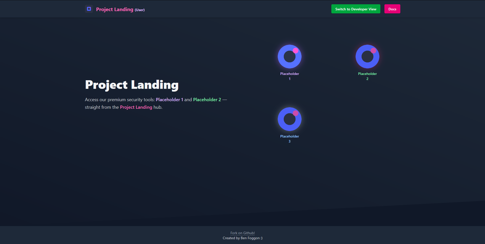

# Project Landing

A customizable web portal for organizing and accessing your self-hosted applications. Project Landing provides a clean, modern dashboard with separate user and developer views.



## Features

- **Multiple Views**: Separate interfaces for users and developers
- **Modern UI**: Clean, responsive design using Tailwind CSS
- **Customizable**: Easily add your own applications and services
- **Lightweight**: No backend required, runs entirely in the browser
- **Password Protection**: Optional password protection for developer view
- **Mobile-Friendly**: Fully responsive for all device sizes

## Demo

Check out the [live demo](https://sg3xhero.github.io/Project-Landing/) to see Project Landing in action. (Not Active Yet)

## Quick Start

1. Clone this repository:
   ```bash
   git clone https://github.com/SG3xHERO/Project-Landing.git
   cd Project-Landing
   ```

2. Customize the links and images in the HTML files to point to your services
3. Deploy to your preferred hosting solution

## Customization

### Adding Your Services

1. Open the appropriate HTML file (`user/index.html` or `developer/index.html`)
2. Locate the app grid section:
   ```html
   <div class="grid grid-cols-2 gap-12 place-items-center md:pl-10">
      <a href="../tbd.html" target="_blank" class="app-link hover-effect vaultwarden">
         
         <span class="text-sm font-semibold text-purple-300">Placeholder<br>1</span>
      </a>
      <!-- Add more services here -->
   </div>
   ```
3. Add or modify the services according to your needs

### Changing Colors and Styles

1. The project uses Tailwind CSS for styling
2. Custom styles are defined in `css/hover-styles.css` and `css/main.css`
3. To add a new service with a custom hover color:
   ```css
   .hover-effect.your-service:hover span {
     color: #your-hex-color;
   }
   ```

### Modifying the Password Protection

The developer view includes optional password protection. To change the password:

1. Open `developer/login.js`
2. Change the password in the `CORRECT_PASSWORD` constant:
   ```javascript
   const CORRECT_PASSWORD = "your-new-password";
   ```

## Project Structure

```
Project-Landing/
├── index.html                # Main landing page
├── 404.html                  # 404 error page
├── tbd.html                  # "Coming Soon" page
├── css/
│   ├── hover-styles.css      # Hover effects for app icons
│   ├── main.css              # Main custom styles
│   └── docs.css              # Documentation page styles
├── images/
│   ├── placeholder-icon.svg  # Generic app icon
│   ├── favicon.svg           # Site favicon
│   └── logo.svg              # Site logo
├── user/
│   └── index.html            # User view
└── developer/
    ├── index.html            # Developer view
    └── login.js              # Password protection script
```

## Browser Compatibility

Project Landing is compatible with all modern browsers:

- Chrome/Edge (Latest)
- Firefox (Latest)
- Safari (Latest)

## Contributing

Contributions are welcome! Please feel free to submit a Pull Request.

1. Fork the repository
2. Create your feature branch (`git checkout -b feature/amazing-feature`)
3. Commit your changes (`git commit -m 'Add some amazing feature'`)
4. Push to the branch (`git push origin feature/amazing-feature`)
5. Open a Pull Request

## License

This project is licensed under the MIT License - see the [LICENSE](LICENSE) file for details.

## Acknowledgments

- [Tailwind CSS](https://tailwindcss.com/) for the styling framework
- All the awesome open-source projects that inspired this dashboard

---

Created with ❤️ - Happy self-hosting!
